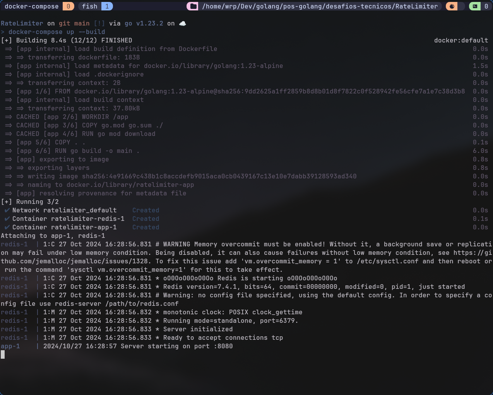
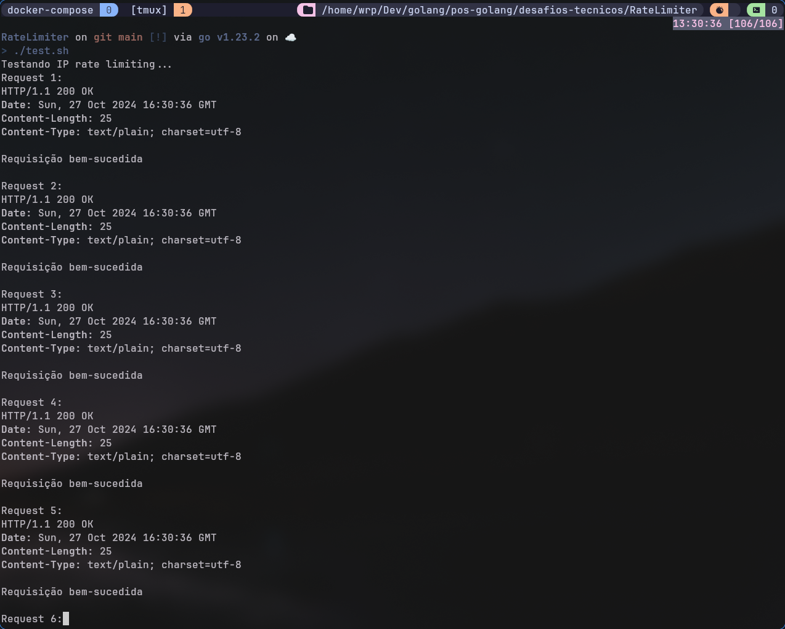
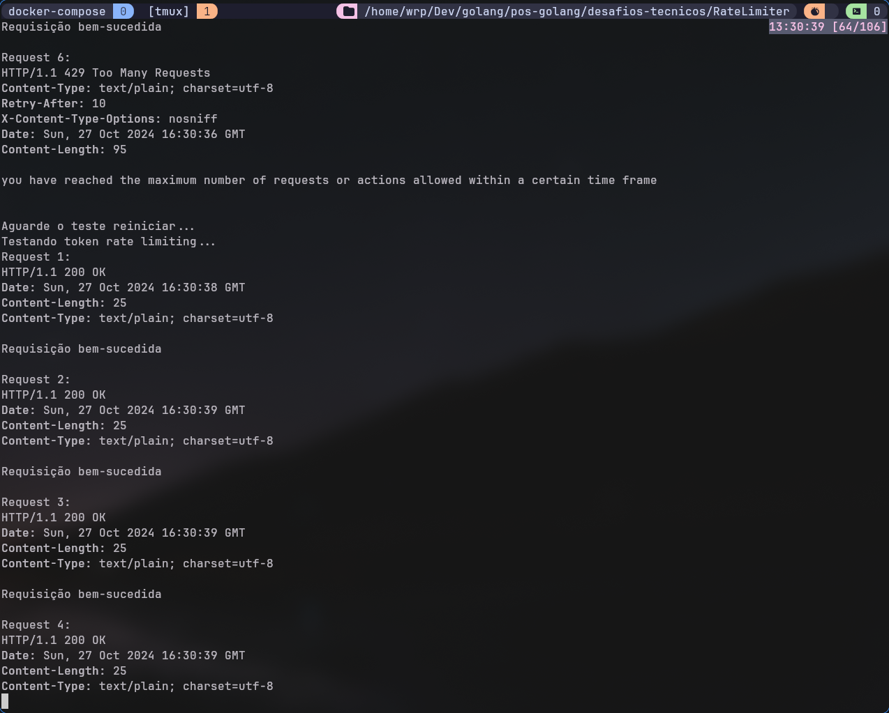
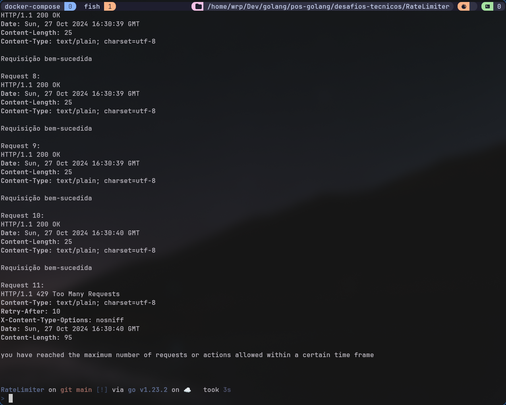
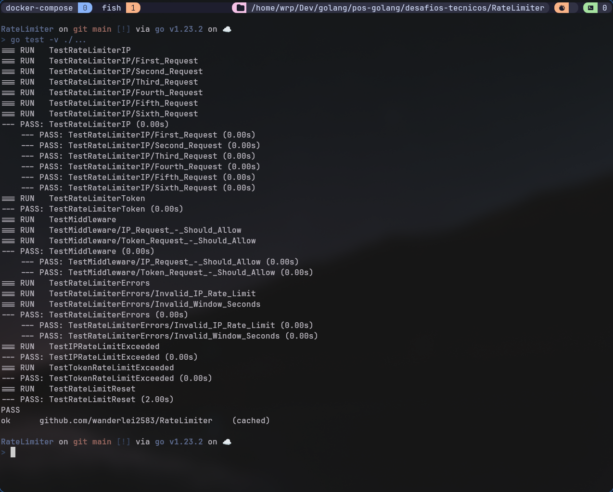
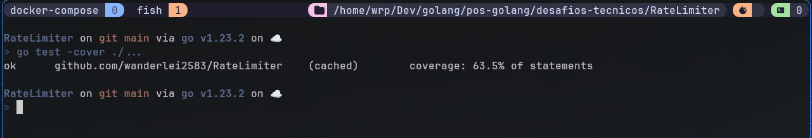
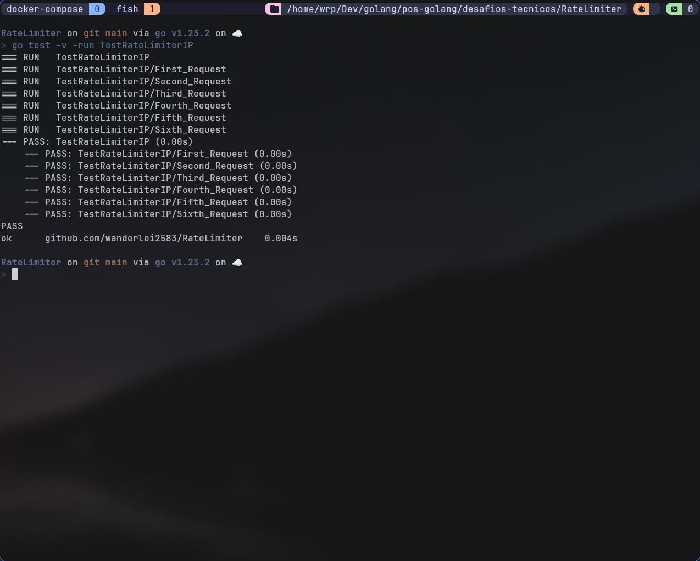

# Rate Limiter Service em Go

Este projeto implementa um rate limiter em Go que pode ser configurado para limitar o número máximo de requisições por segundo com base em um endereço IP específico ou em um token de acesso. O serviço utiliza Redis para armazenamento dos contadores e pode ser facilmente integrado como middleware em aplicações web.

## 🚀 Funcionalidades

- Limitação de requisições por IP
- Limitação de requisições por Token de acesso (API_KEY)
- Configuração flexível via variáveis de ambiente
- Persistência em Redis
- Design extensível com padrão Strategy para storage
- Middleware pronto para uso em aplicações web Go

## 📋 Pré-requisitos

- Go 1.21 ou superior
- Docker e Docker Compose

## 🛠️ Estrutura do Projeto

```
rate-limiter/
├── main.go                # Ponto de entrada da aplicação
├── limiter.go             # Implementação do rate limiter
├── limiter_test.go        # Testes automatizados 
├── storage.go             # Interface de armazenamento
├── redis_storage.go       # Implementação Redis do storage
├── middleware.go          # Middleware HTTP
├── docker-compose.yml     # Configuração dos containers
├── Dockerfile             # Build da imagem Docker
├── README.md              # Documentação
├── test.sh                # Script para teste IP e Token
└── .env                   # Configurações do ambiente
```

## ⚙️ Configurações

O serviço pode ser configurado através das seguintes variáveis de ambiente:

```env
REDIS_HOST=redis         # Host do Redis
REDIS_PORT=6379          # Porta do Redis
IP_RATE_LIMIT=5          # Limite de requisições por IP
IP_WINDOW_SECONDS=1      # Janela de tempo para IP (em segundos)
TOKEN_RATE_LIMIT=10      # Limite de requisições por token
TOKEN_WINDOW_SECONDS=1   # Janela de tempo para token (em segundos)
```

## 🚀 Como Executar

1. Clone o repositório:
```bash
git clone https://github.com/wanderlei2583/RateLimiter.git
cd RateLimiter
```

2. Execute com Docker Compose:
```bash
docker-compose up --build
```


O serviço estará disponível em `http://localhost:8080`

## 📝 Exemplo de Uso

### Teste de limitação por IP:
```bash
# Envie múltiplas requisições
for i in {1..6}; do
    echo "Request $i:"
    curl -i http://localhost:8080/
    echo -e "\n"
    sleep 0.1
done
```

### Teste de limitação por Token:
```bash
# Envie múltiplas requisições com token
for i in {1..11}; do
    echo "Request $i:"
    curl -i -H "API_KEY: abc123" http://localhost:8080/
    echo -e "\n"
    sleep 0.1
done
```



*Teste com o script em bash: [test.sh](github.com/wanderlei2583/RateLimiter/test.sh)*

## 🔍 Comportamento Esperado

1. **Limitação por IP:**
   - Se configurado para 5 req/s, a 6ª requisição dentro de 1 segundo será bloqueada
   - Resposta para requisição bloqueada:
     - Status: 429
     - Mensagem: "you have reached the maximum number of requests or actions allowed within a certain time frame"

2. **Limitação por Token:**
   - Se configurado para 10 req/s, a 11ª requisição dentro de 1 segundo será bloqueada
   - A limitação por token tem precedência sobre a limitação por IP


## 🧪 Testes

O projeto inclui testes automatizados que cobrem:

1. Limitação básica por IP e token
2. Casos de limite excedido
3. Reset após expiração
4. Erros de configuração
5. Funcionamento do middleware

E podem ser executado com o seguinte comando:
```bash
# Executar todos os testes
go test -v ./...

# Executar com cobertura
go test -cover ./...

# Executar teste específico
go test -v -run TestRateLimiterIP
```


*Teste realizado com o comando `go test -v ./...`*


*Teste realizado com o comando `go test -cover ./...`*


*Teste realizado com o comando `go test -v -run TestRateLimiterIP`*

## 🔧 Design Patterns Utilizados

1. **Strategy Pattern:**
   - Interface `RateLimitStorage` permite diferentes implementações de armazenamento
   - Atual implementação usa Redis, mas pode ser facilmente estendido para outros storages

2. **Middleware Pattern:**
   - Implementação como middleware HTTP permite fácil integração com qualquer aplicação web Go

## 📦 Dependências

- github.com/go-redis/redis/v8
- github.com/gorilla/mux
- github.com/joho/godotenv
- github.com/stretchr/testify

## 📄 Licença

Este projeto está sob a licença MIT - veja o arquivo [LICENSE.md](LICENSE.md) para detalhes

## ✒️ Autor

* **Wanderlei R. Pereira** - *Desafio Tecnico - Rate Limiter* - [wanderlei2583](https://github.com/wanderlei2583)

---
⌨️ com ❤️ por [Wanderlei](https://github.com/wanderlei2583) 😊
